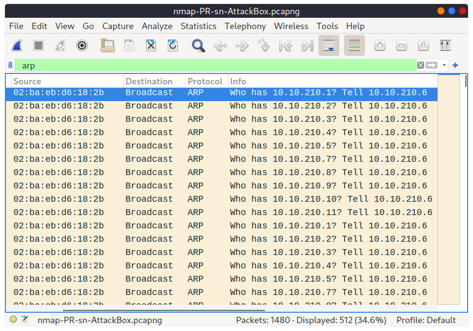
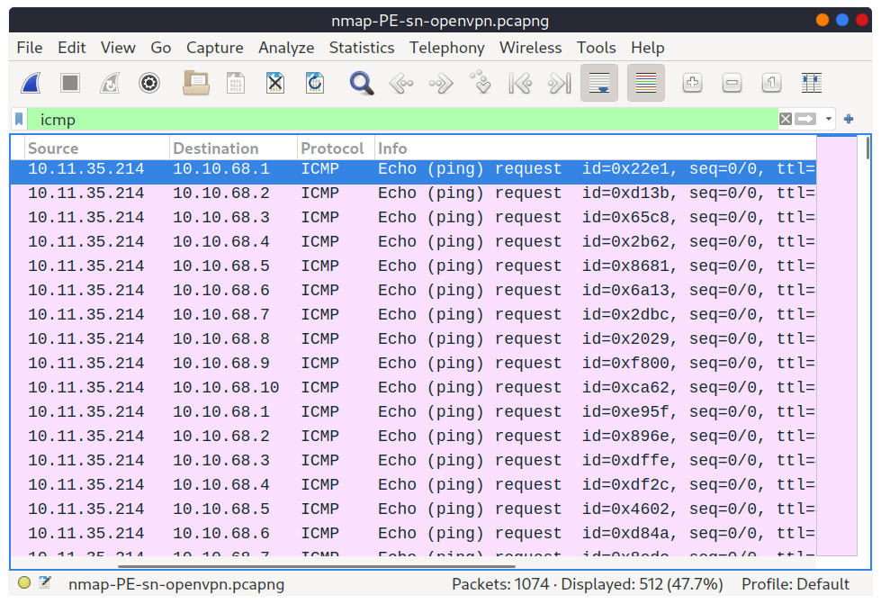
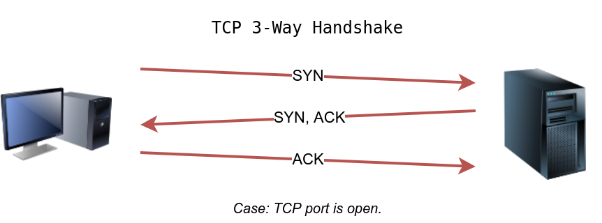
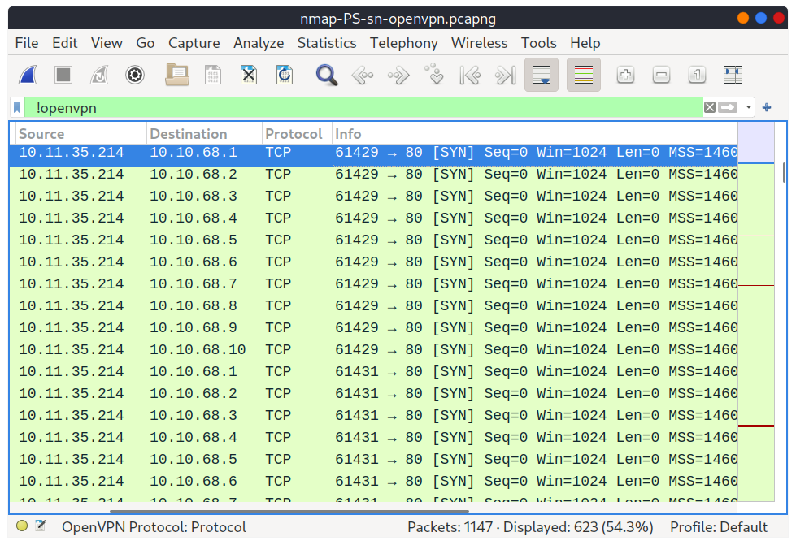
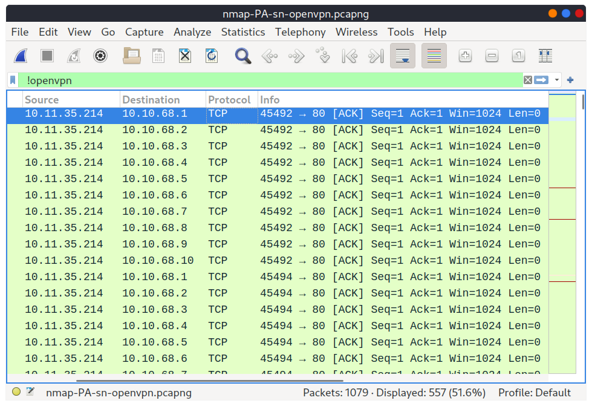
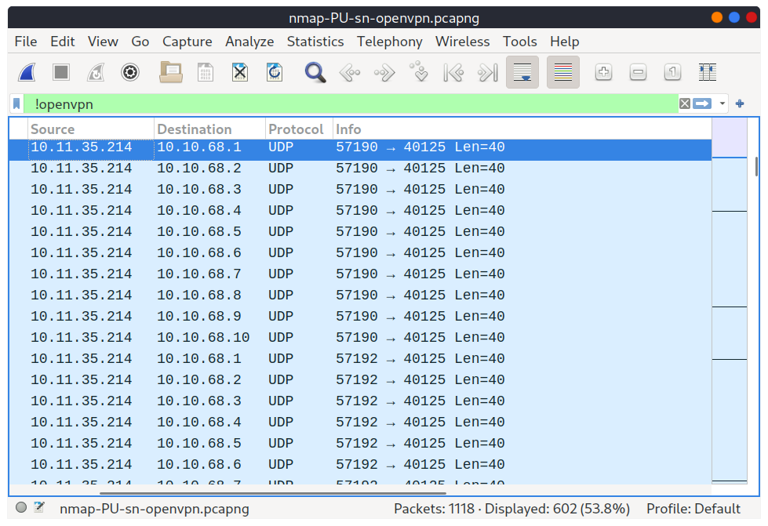

# Nmap Notes 👁️

- Created by _Gordon Lyon_ (Fyodor), a network security expert and open source programmer. It was _released in 1997_
- **Network Mapper** is free, open-source software released under GPL license.
- An industry-standard tool for _mapping networks_, identifying _live hosts_, and discovering _running services_.
- Nmap’s scripting engine can further extend its functionality, from fingerprinting services to exploiting vulnerabilities.
- A Nmap scan usually goes through the steps shown in the figure below, although many are optional and depend on the command-line arguments you provide:
  
- We want to discover more information about a group of hosts or about a subnet. If you are connected to the <u>same subnet</u>, you would expect your <mark>scanner to rely on ARP (Address Resolution Protocol) queries</mark> to discover live hosts. <mark>An ARP query aims to get the hardware address (MAC address)</mark> so that communication over the link-layer becomes possible. however, we can use this to infer that the host is online.
- If you are in `Network A`, you can use ARP <mark>only to discover the devices within that subnet</mark>. Suppose you are connected to a subnet different from the subnet of the target system(s). In that case, all packets generated by your scanner will be routed via the default gateway (router) to reach the systems on another subnet. however, the ARP queries won’t be routed and hence cannot cross the subnet router.
- ARP is a link-layer protocol, and ARP packets are bound to their subnet.
- Add `-sn` if you don’t want to follow that with a port scan.

## Enumerating Targets

- We need to specify the targets we want to scan. Generally speaking, you can provide a list, a range, or a subnet. Examples of target specification are:
  - list: `MACHINE_IP scanme.nmap.org example.com` will scan 3 IP addresses.
  - range: `10.11.12.15-20` will scan 6 IP addresses: 10.11.12.15, 10.11.12.16,… and 10.11.12.20.
  - subnet: `MACHINE_IP/30` will scan 4 IP addresses.
- You can also provide a file as input for your list of targets, `nmap -iL list_of_hosts.txt`.
- If you want to check the list of hosts that Nmap will scan, you can use `nmap -sL TARGETS`. This option will give you a detailed list of the hosts that Nmap will scan without scanning them; however, Nmap will attempt a **reverse-DNS resolution** on all the targets to obtain their names. Names might reveal various information to the pentester. (If you don’t want Nmap to the DNS server, you can add `-n`.)

## Discovering Live Hosts

Nmap discovers live hosts using a variety of techniques including **ICMP (ping)** sweeps, **ARP scans**, and **TCP/UDP port scanning**. These methods allow Nmap to identify active systems on a network by sending different types of packets and observing the responses.

- **ICMP (Ping) Sweeps:** Nmap sends ICMP echo request packets (ping) to target IP addresses. If a host responds with an ICMP echo reply, it's considered live. This is a common method, but it can be blocked by firewalls.
- **ARP Scans:** If Nmap is on the same subnet as the target, it can use ARP requests to discover hosts. ARP scans are faster than ICMP for local networks.
- **TCP/UDP Port Scanning:** Nmap sends TCP SYN or ACK packets, or UDP packets to various ports on the target. If a host responds to these packets, it indicates the port is open and the host is likely active.
- **List Scan:** Nmap can perform a list scan which doesn't send any packets to the target but attempts to resolve hostnames via reverse DNS lookups.
- In addition to these, Nmap can use other techniques:
  - **TCP ACK and SYN Scans:** Used to identify hosts by sending TCP packets with ACK or SYN flags, respectively.
  - **ICMP Timestamp and Address Mask Requests:** Used to identify hosts by sending ICMP timestamp or address mask requests.

## Nmap Host Discovery Using ARP

- There are various ways to discover online hosts. When no host discovery options are provided, Nmap follows the following approaches to discover live hosts:
  1. When a privileged user tries to scan targets on a local network (Ethernet), Nmap uses _ARP requests_. A privileged user is root or a user who belongs to sudoers and can run `sudo`.
  2. When a privileged user tries to scan targets outside the local network, Nmap uses _ICMP echo requests_, _TCP ACK (Acknowledge) to port 80_, _TCP SYN (Synchronize) to port 443_, and _ICMP timestamp request_.
  3. When an unprivileged user tries to scan targets outside the local network, Nmap resorts to a _TCP 3-way handshake_ by sending SYN packets to ports 80 and 443.
- <mark>Nmap, by default, uses a ping scan to find live hosts</mark>, then proceeds to scan live hosts only. If you want to use Nmap to discover online hosts without port-scanning the live systems, you can issue `nmap -sn TARGETS`.
- <mark>ARP scan is possible only if you are on the same subnet as the target systems</mark>.
- On an Ethernet (802.3) and WiFi (802.11), **you need to know the MAC address of any system before you can communicate with it**.
- The MAC address is necessary for the link-layer header; the header contains the _source MAC address_ and the _destination MAC address_ among other fields. To get the MAC address, the OS sends an _ARP query_. **A host that replies to ARP queries is up**. The ARP query only works if the target is on the same subnet as yourself, i.e., on the same Ethernet/WiFi.
- You should expect to see many ARP queries generated during a Nmap scan of a local network. If you want Nmap only to perform an ARP scan _without port-scanning_, you can use `nmap -PR -sn TARGETS`, where -PR indicates that you only want an ARP scan

- If we look at the packets generated using a tool such as `tcpdump` or `Wireshark`, we will see network traffic similar to the figure below. In the figure below, Wireshark displays the `source MAC address`, `destination MAC address`, `protocol`, and `query related to each ARP request`. The source address is the MAC address of our Machine, while the destination is the **broadcast address as we don’t know the MAC address of the target**. However, we see the target’s IP address, which appears in the Info column. In the figure, we can see that we are requesting the MAC addresses of all the IP addresses on the subnet, starting with `10.10.210.1`. The host with the IP address we are asking about will send an **ARP reply with its MAC address**, and that’s how we will know that it is online.

- Talking about ARP scans, we should mention a scanner built around ARP queries: `arp-scan`; it provides many options to customize your scan. One popular choice is `arp-scan --localnet` or simply `arp-scan -l`. This command will send ARP queries to all valid IP addresses on your local networks. Moreover, if your system has more than one interface and you are interested in discovering the live hosts on one of them, you can specify the interface using `-I`. For instance, `sudo arp-scan -I eth0 -l` will send ARP queries for all valid IP addresses on the eth0 interface.
- Similarly, the command `arp-scan` will generate many ARP queries that we can see using tcpdump, Wireshark, or a similar tool. We can notice that the packet capture for `arp-scan` and `nmap -PR -sn` yield similar traffic patterns.

## Nmap Host Discovery Using ICMP

### ICMP Echo Request

- We can ping every IP address on a target network and see who would respond to our `ping requests (ICMP Type 8/Echo)` with a `ping reply (ICMP Type 0)`
- <mark>Many firewalls block ICMP echo</mark>; new versions of _MS Windows_ are configured with a host firewall that **blocks** `ICMP echo requests` by default.
- Remember that an ARP query _will precede_ the ICMP request if your target is _on the same subnet_.
- To use `ICMP echo request` to discover live hosts, add the option `-PE`.
- As shown in the following figure, an ICMP echo scan works by sending an `ICMP echo request` and expects the target to reply with an `ICMP echo reply` if it is online.
  
  
- Generally speaking, we don’t expect to learn the MAC addresses of the targets unless they are on the same subnet as our system.
- Nmap didn’t need to send **ICMP packets** as it confirmed that the hosts are up based on the **ARP responses** it received.
- Because `ICMP echo requests` tend to be blocked, you might also consider `ICMP Timestamp` or `ICMP Address Mask requests` to tell if a system is online.

### ICMP Timestamp Request

- Nmap uses `timestamp request (ICMP Type 13)` and checks whether it will get a `Timestamp reply (ICMP Type 14)`.
- Adding the `-PP` option tells Nmap to use ICMP timestamp requests. As shown in the figure below, you expect live hosts to reply:
  
  

### ICMP Address Mask Request

- Nmap uses `address mask queries (ICMP Type 17)` and checks whether it gets an `address mask reply (ICMP Type 18)`.
- This scan can be enabled with the option `-PM`.
- As shown in the figure below, live hosts are expected to reply to ICMP address mask requests:
  
- Although we didn’t get any reply and could not figure out which hosts are online, it is essential to note that this scan sent ICMP address mask requests **to every valid IP address** and _waited for a reply_. Each ICMP request was sent **twice**, as we can see in the screenshot below:
  

> **If the scan retuned none**, The reason is that _the target system_ or a _firewall_ on the route is **blocking** this type of ICMP packet. Therefore, it is essential to learn multiple approaches to achieve the same result. If one type of packet is being blocked, we can always choose another to discover the target network and services.

## Nmap Host Discovery Using TCP and UDP

### TCP SYN Ping

- We can send a packet with the **SYN (Synchronize) flag** set to a _TCP port, 80 by default_, and wait for a response
- An open port should reply with a **SYN/ACK (Acknowledge)**.
- A closed port would result in an **RST (Reset)**.
- In this case, we only check whether we will get any response to infer whether the host is up. The specific state of the port is not significant here.
- The figure below is a reminder of how a **TCP 3-way handshake** usually works:
  
- If you want Nmap to use TCP SYN ping, you can do so via the option `-PS` followed by the port number, range, list, or a combination of them. For example, `PS21` will target port 21, while `-PS21-25` will target ports 21, 22, 23, 24, and 25. Finally `-PS80,443,8080` will target the three ports 80, 443, and 8080.
- Privileged users (root and sudoers) can send TCP SYN packets and **don’t need to complete the TCP 3-way handshake even if the port is open**, as shown in the figure below. Unprivileged users **have no choice but to complete the 3-way handshake if the port is open**:
  
- Technically speaking, since we didn’t specify any TCP ports to use in the TCP ping scan, _Nmap used common ports_; in this case, it **is TCP port 80**. Any service listening on port 80 is _expected to reply_, indirectly indicating that the host is online:
  

> TCP SYN Ping scan does not require a privileged account

### TCP ACK Ping

- This sends a packet with an **ACK flag set**.
- You must be running Nmap as a **privileged user** to be able to accomplish this.
- If you try it as an **unprivileged user**, Nmap will attempt a 3-way handshake.
- By default, **port 80** is used.
- `-PA` should be followed by a port number, range, list, or a combination of them. For example, consider `-PA21`, `-PA21-25` and `-PA80,443,8080`. If no port is specified, port 80 will be used
- The following figure shows that any **TCP packet with an ACK flag** should get a **TCP packet back with an RST flag** set. The target responds with the RST flag set because the _TCP packet with the ACK flag is not part of any ongoing connection_. The expected response is used to detect if the target host is up:
  
- If we peek at the network traffic as shown in the figure below, we will discover many packets with the _ACK flag_ set and sent to _port 80_ of the target systems:
  
- Nmap sends each packet **twice**.
- The systems that don’t respond are **offline or inaccessible**.

> TCP ACK Ping scan requires a privileged account

### UDP Ping

- we use **UDP** to discover if the host is online.
- Contrary to TCP SYN ping, sending a **UDP packet** to an open port is **not expected to lead to any reply**.
- However, if we send a **UDP packet** to a closed UDP port, we expect to get an **ICMP port unreachable packet**; this indicates that the target system is up and available.
- In the following figure, we see a UDP packet sent to an open UDP port and not triggering any response. However, sending a UDP packet to any closed UDP port can trigger a response indirectly indicating that the target is online:
  
  
- Nmap uses `-PU` for UDP ping.
- In the following Wireshark screenshot, we notice Nmap sending UDP packets to UDP ports that are most likely _closed_. The image below shows that Nmap uses an _uncommon UDP port_ to trigger an _ICMP destination unreachable_ (port unreachable) error:
  

> On a side note, **Masscan** uses a similar approach to discover the available systems. However, to finish its network scan quickly, Masscan is quite aggressive with the rate of packets it generates. The syntax is quite similar: `-p` can be followed by a port number, list, or range.

## Using Reverse-DNS Lookup

- Nmap’s default behaviour is to use **reverse-DNS online hosts**.
- Because the hostnames can _reveal a lot_, this can be a helpful step.
- However, if you don’t want to send such DNS queries, you use `-n` to skip this step.
- By default, _Nmap will look up online hosts_; however, you can use the option `-R` to query the DNS server **even for offline hosts**.
- If you want to use a _specific DNS server_, you can add the `--dns-servers DNS_SERVER` option.

## Summary

| Scan Type              | Example Command                             |
| ---------------------- | ------------------------------------------- |
| ARP Scan               | `sudo nmap -PR -sn MACHINE_IP/24`           |
| ICMP Echo Scan         | `sudo nmap -PE -sn MACHINE_IP/24`           |
| ICMP Timestamp Scan    | `sudo nmap -PP -sn MACHINE_IP/24`           |
| ICMP Address Mask Scan | `sudo nmap -PM -sn MACHINE_IP/24`           |
| TCP SYN Ping Scan      | `sudo nmap -PS22,80,443 -sn MACHINE_IP/30`  |
| TCP ACK Ping Scan      | `sudo nmap -PA22,80,443 -sn MACHINE_IP/30`  |
| UDP Ping Scan          | `sudo nmap -PU53,161,162 -sn MACHINE_IP/30` |

| Option | Purpose                                |
| ------ | -------------------------------------- |
| -n     | no DNS lookup                          |
| -R     | reverse-DNS lookup for all hosts       |
| -sn    | host discovery only (no port-scanning) |

## 🔍 To See

- [arp-scan](https://linux.die.net/man/1/arp-scan) - The ARP scanner (die doc)
- [arp-scan](https://www.royhills.co.uk/wiki/index.php/Arp-scan_Documentation) - The ARP scanner (wiki doc)
- [masscan](https://manpages.ubuntu.com/manpages/lunar/man8/masscan.8.html) - Fast scan of the Internet
