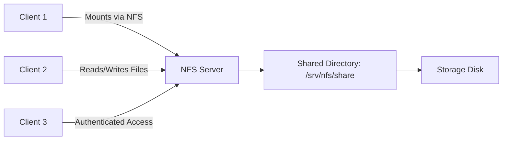
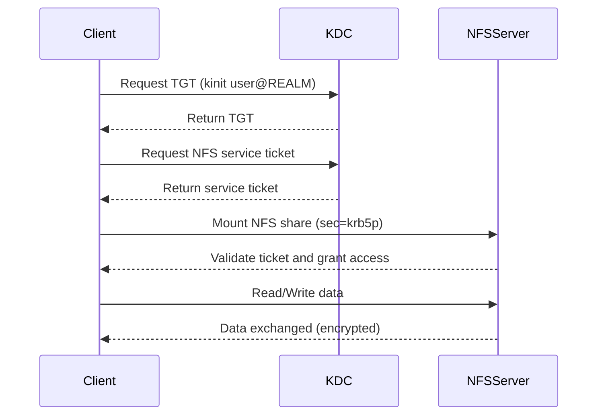

# 🗂️ Understanding and Configuring NFS (Network File System) in Linux

## 📘 Overview

**Network File System (NFS)** is a distributed file system protocol that allows systems to share directories and files across a network.  
It makes remote files accessible as if they were local — ideal for centralized storage, backups, and multi-user collaboration.

Originally developed by **Sun Microsystems**, NFS is widely supported across **Linux**, **Unix**, and mixed environments.

## 📊 NFS Architecture (Visual Overview)



**Explanation:**

- The **NFS Server** exports (`/etc/exports`) directories to the network.
- **Clients** mount them over TCP (default port **2049**).
- Files are read/written remotely — handled seamlessly by the kernel-level NFS subsystem.

## ⚙️ How NFS Works

| Role                   | Description                                |
| ---------------------- | ------------------------------------------ |
| **Server**             | Hosts and exports shared directories       |
| **Client**             | Mounts and accesses the remote directories |
| **Protocol**           | Uses TCP/UDP (port 2049 by default)        |
| **Supported Versions** | NFSv3, NFSv4 (recommended for security)    |

## 🧰 Prerequisites

✅ Root or sudo privileges
✅ Systems connected to the same network
✅ Firewall rules allow NFS ports
✅ Proper hostname or IP resolution

## 🖥️ Step 1: Install NFS Packages

### 🐧 On Debian/Ubuntu

```bash
sudo apt update
sudo apt install nfs-kernel-server nfs-common -y
```

### 🎩 On RHEL / CentOS / Fedora

```bash
sudo dnf install nfs-utils -y
```

### 🏔️ On Arch Linux

```bash
sudo pacman -Syu nfs-utils
```

Enable and start NFS services:

```bash
sudo systemctl enable --now nfs-server
```

## 📁 Step 2: Create and Export a Shared Directory

### 1️⃣ Create directory

```bash
sudo mkdir -p /srv/nfs/share
sudo chown nobody:nogroup /srv/nfs/share    # Debian/Ubuntu
# or
sudo chown nfsnobody:nfsnobody /srv/nfs/share  # RHEL/Arch
```

### 2️⃣ Edit `/etc/exports`

```bash
sudo nano /etc/exports
```

Add:

```
/srv/nfs/share 192.168.1.0/24(rw,sync,no_subtree_check)
```

- `rw` → allows read/write access for clients
- `sync` → commits writes immediately to disk
- `no_subtree_check` → avoids subtree checking for reliability
- Replace `192.168.1.0/24` with the actual client subnet or IP

### 3️⃣ Apply exports

```bash
sudo exportfs -ra
sudo exportfs -v # verify
```

Check the directory permissions:

```bash
ls -ld /srv/nfs/share
```

- Example default: `drwxr-xr-x` → only owner can write

Adjust permissions for a client group (`nfs_group`) safely:

```bash
sudo chown -R :nfs_group /srv/nfs/share # Ensures users in group `nfs_group` can write without opening write access to everyone
sudo chmod -R 775 /srv/nfs/share        # owner and group can read/write/execute; others read/execute
```

### NFS Ownership Behavior

- NFS uses **UID/GID from the client**.
- Users must have the **same UID/GID as on the server** for correct permissions.
- Root on the client is squashed to `nobody` by default (`root_squash`) → cannot write unless `no_root_squash` is used.

Example file on the client:

```bash
ls -ls /mnt/nfs/README.md
4 -rwxrwxr-x 1 root nfs_group README.md
```

- Owner: `root`
- Group: `nfs_group`
- Permissions: `rwxrwxr-x` → owner and group can write, others cannot
- Normal users in group `nfs_group` can write, root cannot (safe default)

## 🔥 Step 3: Configure Firewall

### RHEL / CentOS / Fedora

```bash
sudo firewall-cmd --permanent --add-service=nfs
sudo firewall-cmd --permanent --add-service=mountd
sudo firewall-cmd --permanent --add-service=rpc-bind
sudo firewall-cmd --reload
```

### Ubuntu / Debian (UFW)

```bash
sudo ufw allow from 192.168.1.0/24 to any port nfs
```

### Arch Linux (firewalld or nftables)

```bash
sudo firewall-cmd --permanent --add-service=nfs
sudo firewall-cmd --reload
```

## 💻 Step 4: Mount NFS Share (Client Side)

### 1️⃣ Create mount point

```bash
sudo mkdir -p /mnt/nfs_share
```

### 2️⃣ Mount the share

```bash
sudo mount 192.168.1.10:/srv/nfs/share /mnt/nfs_share
```

_(Replace `192.168.1.10` with your NFS server’s IP.)_

### 3️⃣ Verify mount

```bash
df -h | grep nfs
```

## 🔄 Step 5: Auto-Mount at Boot

Edit `/etc/fstab`:

```
192.168.1.10:/srv/nfs/share  /mnt/nfs_share  nfs  defaults  0  0
```

### Unmount

```bash
sudo umount /mnt/nfs
```

If busy:

```bash
sudo lsof /mnt/nfs      # see open files
sudo fuser -m /mnt/nfs  # see processes using the mount
sudo umount -l /mnt/nfs # lazy unmount
sudo umount -f /mnt/nfs # force unmount
```

## Best Practices

- Use a dedicated group (`nfs_group`) for clients needing write access
- Avoid `chmod 777` unless testing; use group-based permissions
- Keep `root_squash` enabled for security unless trusted clients require root access
- Ensure UID/GID match between client and server for consistent permissions

## 🔒 Step 6: Securing NFS with Authentication (Kerberos)

Modern **NFSv4** supports **Kerberos-based authentication (RPCSEC_GSS)**, which provides encryption and access control.



### 🧱 Security Levels

| Option      | Security Level                      |
| ----------- | ----------------------------------- |
| `sec=sys`   | Default (no authentication)         |
| `sec=krb5`  | Authenticated access                |
| `sec=krb5i` | Authenticated + integrity checking  |
| `sec=krb5p` | Authenticated + encrypted (privacy) |

### 🧩 Requirements

- A working **Kerberos Key Distribution Center (KDC)** (MIT Kerberos, FreeIPA, etc.)
- NFSv4 enabled on server and client
- Host principals in `/etc/krb5.keytab`
- Proper DNS and time synchronization (NTP)

### ⚙️ Configuration Steps

#### 1️⃣ Enable GSS daemons

```bash
sudo systemctl enable --now rpc-gssd
sudo systemctl enable --now rpc-svcgssd
```

#### 2️⃣ Update exports for Kerberos

```
/srv/nfs/share 192.168.1.0/24(rw,sync,sec=krb5p)
```

#### 3️⃣ Re-export and restart services

```bash
sudo exportfs -ra
sudo systemctl restart nfs-server
```

#### 4️⃣ Client: Obtain Kerberos ticket

```bash
kinit username@YOUR.REALM
```

#### 5️⃣ Mount securely

```bash
sudo mount -t nfs4 -o sec=krb5p server.example.com:/srv/nfs/share /mnt/nfs_secure
```

## 🧠 Troubleshooting

| Problem                | Likely Cause                  | Fix                                           |
| ---------------------- | ----------------------------- | --------------------------------------------- |
| `Permission denied`    | Wrong export permissions      | Verify `/etc/exports`, re-run `exportfs -ra`  |
| `Stale file handle`    | Server share modified         | Unmount and remount                           |
| `Mount hangs`          | Firewall or NFS service issue | Check open ports and `nfs-server` status      |
| `Kerberos auth failed` | Keytab or realm misconfig     | Validate `/etc/krb5.conf` and host principals |

## 🧹 Step 7: Unmount

To unmount:

```bash
sudo umount /mnt/nfs_share
```

## 🛡️ Best Security Practices

✅ Use **NFSv4** with `sec=krb5p` for encryption
✅ Restrict access by subnet or hostname
✅ Apply `root_squash`:

```
/srv/nfs/share 192.168.1.0/24(rw,sync,root_squash)
```

✅ Keep systems updated and monitor logs:

```bash
sudo journalctl -u nfs-server
```

✅ Use `fail2ban` or firewall rules to limit unauthorized access

## 🏁 Summary

| Feature             | Benefit                              |
| ------------------- | ------------------------------------ |
| Centralized Storage | Simplifies file management           |
| Kerberos Security   | Adds authentication & encryption     |
| Cross-Platform      | Works across Linux & Unix            |
| Scalable            | Suitable for enterprise environments |

## 📚 References

- [Arch Linux NFS Wiki](https://wiki.archlinux.org/title/NFS)
- [Ubuntu NFS HowTo](https://help.ubuntu.com/community/SettingUpNFSHowTo)
- [Red Hat NFS Documentation](https://access.redhat.com/documentation/en-us/red_hat_enterprise_linux/)
- [MIT Kerberos Documentation](https://web.mit.edu/kerberos/)
