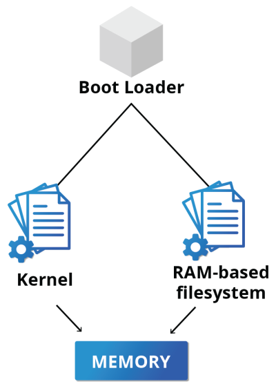
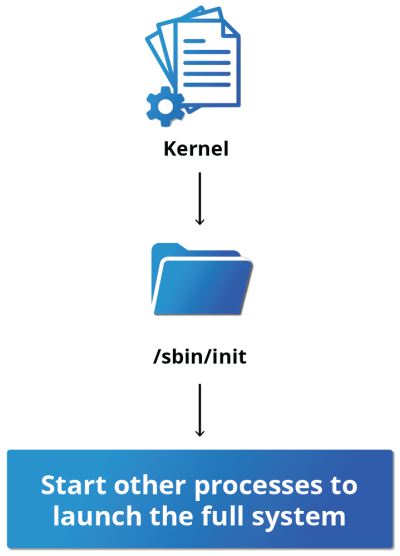

# Linux Basics and System Startup

## The Boot Process

The Linux boot process is the procedure for initializing the system. It consists of everything that
happens from when the computer power is first switched on until the user interface is fully operational.


### BIOS - The First Step

While Linux runs on many kinds of hardware, we will concentrate on the x86 family, which is the basis of almost all desktop and laptop PCs. Starting an **x86-based Linux system** involves a number of steps. When the computer is powered on, the Basic Input/Output System (BIOS) initializes the hardware, including the screen and keyboard, and tests the main memory. This process is also called **POST** (Power On Self Test).

The BIOS software is stored on a **read-only** memory (ROM) chip on the motherboard. After this, the remainder of the boot process is controlled by the operating system (OS).


### Master Boot Record (MBR), EFI Partition, and Boot Loader

Once the POST is completed, system control passes from the BIOS to the **boot loader**. The boot loader is usually stored on one of the system’s storage devices, such as a hard disk or SSD drive, either in the boot sector (for traditional BIOS/MBR systems) or the EFI partition (for more recent (Unified) Extensible Firmware Interface or EFI/UEFI systems). Up to this stage, the machine does not access any mass storage media. Then, information on the date, time, and the most important peripherals are loaded from the **CMOS** values (after a technology used for the battery-powered memory store, which allows the system to keep track of the date and time even when it is powered off).

A number of boot loaders exist for Linux; the most common ones are **GRUB** (for GRand Unified Boot loader), **ISOLINUX** (for booting from removable media), and **DAS U-Boot** (for booting on embedded devices/appliances). Most Linux boot loaders can present a user interface for choosing alternative options for booting Linux and even other operating systems that might be installed. When booting Linux, the boot loader is responsible for **loading the kernel image** and the **initial RAM disk or filesystem** (which contains some critical files and device drivers needed to start the system) into memory.


### Boot Loader in Action

The boot loader has two distinct stages:

For systems using the **BIOS/MBR** method, the boot loader resides at the first sector of the hard disk, also known as the Master Boot Record (MBR). The size of the MBR is just **512 bytes**. In this stage, the boot loader examines the **partition table** and finds a bootable partition. Once it finds a bootable partition, it then searches for the second stage boot loader, for example GRUB, and loads it into RAM (Random Access Memory). For systems using the EFI/UEFI method, UEFI firmware reads its Boot Manager data to determine which UEFI application is to be launched and from where (i.e., from which disk and partition the EFI partition can be found). The firmware then launches the UEFI application, for example GRUB, as defined in the boot entry in the firmware's boot manager. This procedure is more complicated but more versatile than the older MBR methods.

The second stage boot loader resides under `/boot`. A splash screen is displayed, which allows us to choose which operating system (OS) and/or kernel to boot. After the OS and kernel are selected, the boot loader loads the kernel of the operating system into RAM and passes control to it. Kernels are almost always compressed, so the first job they have is to uncompress themself. After this, it will check and analyze the system hardware and initialize any hardware device drivers built into the kernel.

### The Initial RAM Disk

The **initramfs** filesystem image contains programs and binary files that perform all actions needed to mount the proper root filesystem, including providing the kernel functionality required for the specific filesystem that will be used, and loading the device drivers for mass storage controllers, by taking advantage of the **udev** system (for user device), which is responsible for figuring out which devices are present, locating the device drivers they need to operate properly, and loading them. After the root filesystem has been found, it is checked for errors and mounted.

The **mount** program instructs the operating system that a filesystem is ready for use and associates it with a particular point in the overall hierarchy of the filesystem (**the mount point**). If this is successful, the initramfs is cleared from RAM, and the **init** program on the root filesystem (`/sbin/init`) is executed.

init handles the mounting and pivoting over to the final real root filesystem. If special hardware drivers are needed before the mass storage can be accessed, they must be in the initramfs image.


### Text-Mode Login

Near the end of the boot process, **init** starts a number of text-mode login prompts. These enable you to type your username, followed by your password, and to eventually get a command shell. However, if you are running a system with a graphical login interface, you will not see these at first.

The terminals which run the command shells can be accessed using the `ALT+fn`. Most distributions start six text terminals and one graphics terminal starting with `F1` or `F2`. Within a graphical environment, switching to a text console requires pressing `CTRL+ALT+F7|F1`.

Usually, the default command shell is **bash** (the GNU Bourne Again Shell), but there are a number of other advanced command shells available. The shell prints a text prompt, indicating it is ready to accept commands; after the user types the command and presses `Enter`, the command is executed, and another prompt is displayed after the command is done.


## Kernel, init and Services

### The Linux Kernel

The boot loader loads both the **kernel** and an initial RAM–based file system (initramfs) into memory, so it can be used directly by the kernel.

When the kernel is loaded in RAM, it immediately initializes and configures the computer’s memory and also configures all the hardware attached to the system. This includes all processors, I/O subsystems, storage devices, etc. The kernel also loads some necessary user space applications.



### `/sbin/init` and Services

Once the kernel has set up all its hardware and mounted the root filesystem, the kernel runs `/sbin/init`. This then becomes the initial process, which then starts other processes to get the system running. Most other processes on the system trace their origin ultimately to init; exceptions include the so-called kernel processes. These are started by the kernel directly, and their job is to manage internal operating system details.

Besides starting the system, `init` is responsible for keeping the system running and for shutting it down cleanly. One of its responsibilities is to act when necessary as a manager for all non-kernel processes; it cleans up after them upon completion, and restarts user login services as needed when users log in and out, and does the same for other background system services.

Traditionally, this process startup was done using conventions that date back to the 1980s and the System V variety of UNIX. This serial process (called `SysVinit`) had the system pass through a sequence of `runlevels` containing collections of scripts that start and stop services. Each runlevel supported a different mode of running the system. Within each runlevel, individual services could be set to run, or to be shut down if running.

However, all major distributions have moved away from this sequential method of system initialization, although they usually can emulate many System V utilities for compatibility purposes.



### Startup Alternatives

**SysVinit** viewed things as a serial process, divided into a series of sequential stages. Each stage required completion before the next could proceed. Thus, startup did not easily take advantage of the parallel processing that could be done with the **multiple processors** or cores found on modern systems.

Furthermore, starting up and rebooting were seen as relatively rare events; exactly how long they took was not considered important. This is no longer true, especially with mobile devices and embedded Linux systems. Some modern methods, such as the use of containers, can require almost instantaneous startup times. Thus, systems now require methods with faster and enhanced capabilities. Finally, the older methods required rather complicated startup scripts, which were difficult to keep universal across distribution versions, kernel versions, architectures, and types of systems. The two main alternatives developed were:

- **Upstart**
  - Developed by Ubuntu and first included in 2006
  - Adopted in Fedora 9 (in 2008) and in RHEL 6 and its clones

- **systemd**
  - Adopted by Fedora first (in 2011)
  - Adopted by RHEL 7 and SUSE
  - Replaced Upstart in Ubuntu 16.04

While the migration to `systemd` was rather controversial, it has been adopted by all major distributions.

### `systemd` Features


Systems with `systemd` start up faster than those with earlier `init` methods. This is largely because it replaces a serialized set of steps with aggressive parallelization techniques, which permits multiple services to be initiated simultaneously.

Complicated startup shell scripts are replaced with simpler configuration files, which enumerate what has to be done before a service is started, how to execute service startup, and what conditions the service should indicate have been accomplished when startup is finished. One thing to note is that `/sbin/init` now just points to `/lib/systemd/systemd`; i.e. `systemd` takes over the `init` process.

- One `systemd` command (`systemctl`) is used for most basic tasks. While we have not yet talked about working at the command line, here is a brief listing of its use:
  - Starting, stopping, restarting a service (using `httpd`, the Apache web server, as an example) on a currently running system:

  ```bash
  sudo systemctl start|stop|restart httpd.service
  ```

  - Enabling or disabling a system service from starting up at system boot:

  ```bash
  sudo systemctl enable|disable httpd.service
  ```

  - Checking on the status of a service:

  ```bash
  sudo systemctl status httpd.service
  ```

In most cases, the `.service` can be omitted. There are many technical differences with older methods that lie beyond the scope of our discussion.

## Linux Filesystem Basics

### Linux Filesystems
