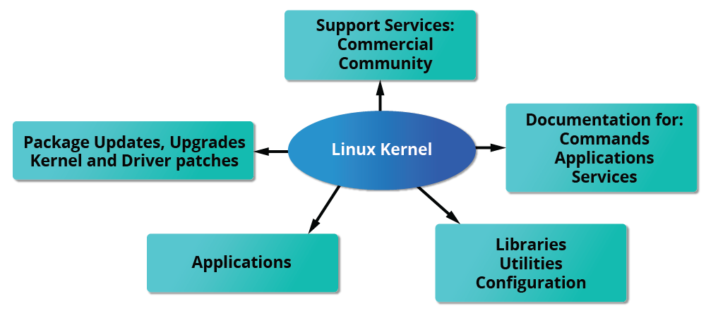
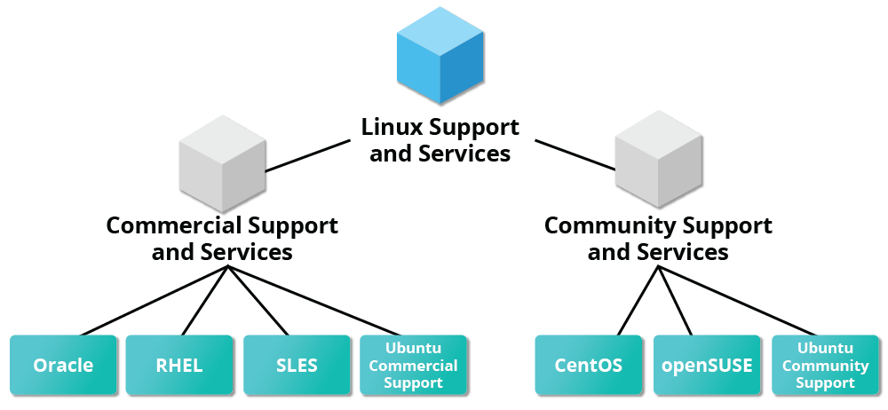

# Linux Notes

## Linux Philosophy and Concepts

### Linux History

- Linux is an **open source computer operating system**, initially developed on and for Intel **x86-based** personal computers. It has been subsequently ported to an astoundingly long list of other hardware platforms, from tiny embedded appliances to the world's largest supercomputers.

- In 1992, Linux was re-licensed using the General Public License (GPL) by GNU (a project of the Free Software Foundation or FSF, which promotes freely available software), which enabled it to build a worldwide community of developers. By combining the kernel with other system components from the GNU project, numerous other developers created complete systems called Linux Distributions, which first appeared in the mid-90s.

- The Linux distributions created in the mid-90s provided the basis for fully free (in the sense of freedom, not zero cost) computing and became a driving force in the open source software movement. In 1998, major companies like IBM and Oracle announced their support for the Linux platform and began major development efforts as well.

- Today, Linux powers more than half of the servers on the Internet, the majority of smartphones (via the Android system, which is built on top of Linux), more than 90 percent of the public cloud workload, and all of the world’s most powerful supercomputers.

### Linux Philosophy

- Linux borrows heavily from the well-established family of UNIX operating systems. It was written to be a free and open source alternative; at the time, UNIX was designed for computers much more powerful than PCs, and furthermore, it was quite expensive.

- Files are stored in a hierarchical filesystem, with the top node of the system being the root or simply "/".

- Whenever possible, Linux makes its components available via files or objects that look like files. Processes, devices, and network sockets are all represented by file-like objects and can often be worked with using the same utilities used for regular files. Linux is a fully multitasking (i.e., multiple threads of execution are performed simultaneously), multiuser operating system with built-in networking and service processes known as daemons in the UNIX world.

> [!NOTE]
> Linux was inspired by UNIX, but it is not UNIX.

- The Linux philosophy centers on simplicity, modularity, and openness. It advocates for building small, single-purpose programs that perform one task well. These programs can be combined in various ways to accomplish complex operations, promoting efficiency and flexibility. Linux follows five core principles:

| Principle                                                   | Description                                                                                                                                                    |
| ----------------------------------------------------------- | -------------------------------------------------------------------------------------------------------------------------------------------------------------- |
| Everything is a file                                        | All configuration files for the various services running on the Linux operating system are stored in one or more text files.                                   |
| Small, single-purpose programs                              | Linux offers many different tools that we will work with, which can be combined to work together.                                                              |
| Ability to chain programs together to perform complex tasks | The integration and combination of different tools enable us to carry out many large and complex tasks, such as processing or filtering specific data results. |
| Avoid captive user interfaces                               | Linux is designed to work mainly with the shell (or terminal), which gives the user greater control over the operating system.                                 |
| Configuration data stored in a text file                    | An example of such a file is the /etc/passwd file, which stores all users registered on the system.                                                            |

### Linux Community

- The Linux community is a far-reaching ecosystem consisting of developers, system administrators, users, and vendors who use many different forums to connect with one another.
  Among the most popular are:
  - Internet Relay Chat (IRC) software (such as WeeChat, HexChat, Pidgin, and XChat)
  - Online communities and discussion boards including Linux User Groups (both local and online)
  - Many collaborative projects hosted on services such as GitHub and GitLab
  - Newsgroups and mailing lists, including the Linux Kernel Mailing List
  - Community events, e.g., Hackathons, Install Fests, Open Source Summits, Embedded Linux Conferences, and many other conferences and get-togethers.

- A portal to one of the most powerful online user communities can be found at [linux.com](https://www.linux.com). This site is hosted by The Linux Foundation and serves over one million unique visitors every month. It has active sections on:
  - News
  - Community discussion threads
  - Free tutorials and user tips.

### Linux Terminology

- Kernel: Glue between hardware and applications
- Distribution: Collection of software making up a Linux-based OS (e.g: RedHat, fedora, Arch...)
- Boot Loader: Program that boot s the OS (e.g: GRUB and ISOLINUX)
- Service: Program that runs as background process (e.g: httpd, nfsd, ntpd, ftpd, named...)
- Filesystem (FS): Method for storing and organizing files (e.g: ext3, ext4, FAT, XFS, NTFS, Btrfs...)
- X Window System: Graphical subsystem on nearly all Linux systems
- Desktop Environment: Graphical user interface on top of the OS (e.g: GNOME, KDE, Xfce, Fluxbox...)
- Command Line: Interface for typing commands on top of the OS
- Shell: Command line interpreter that interprets the command line input and instructs the OS
  to perform any necessary tasks and commands (e.g: bash, tcsh, zsh...)

## Linux Components

| Component       | Description                                                                                                                                                                                                                                                                                                                                     |
| --------------- | ----------------------------------------------------------------------------------------------------------------------------------------------------------------------------------------------------------------------------------------------------------------------------------------------------------------------------------------------- |
| Bootloader      | A piece of code that runs to guide the booting process to start the operating system. Parrot Linux uses the GRUB Bootloader.                                                                                                                                                                                                                    |
| OS Kernel       | The kernel is the main component of an operating system. It manages the resources for system's I/O devices at the hardware level.                                                                                                                                                                                                               |
| Daemons         | Background services are called "daemons" in Linux. Their purpose is to ensure that key functions such as scheduling, printing, and multimedia are working correctly. These small programs load after we booted or log into the computer.                                                                                                        |
| OS Shell        | The operating system shell or the command language interpreter (also known as the command line) is the interface between the OS and the user. This interface allows the user to tell the OS what to do. The most commonly used shells are Bash, Tcsh/Csh, Ksh, Zsh, and Fish.                                                                   |
| Graphics server | This provides a graphical sub-system (server) called "X" or "X-server" that allows graphical programs to run locally or remotely on the X-windowing system.                                                                                                                                                                                     |
| Window Manager  | Also known as a graphical user interface (GUI). There are many options, including GNOME, KDE, MATE, Unity, and Cinnamon. A desktop environment usually has several applications, including file and web browsers. These allow the user to access and manage the essential and frequently accessed features and services of an operating system. |
| Utilities       | Applications or utilities are programs that perform particular functions for the user or another program.                                                                                                                                                                                                                                       |

## Linux Architecture

The Linux operating system can be broken down into layers:

| Layer          | Description                                                                                                                                                                                                                                                                                        |
| -------------- | -------------------------------------------------------------------------------------------------------------------------------------------------------------------------------------------------------------------------------------------------------------------------------------------------- |
| Hardware       | Peripheral devices such as the system's RAM, hard drive, CPU, and others.                                                                                                                                                                                                                          |
| Kernel         | The core of the Linux operating system whose function is to virtualize and control common computer hardware resources like CPU, allocated memory, accessed data, and others. The kernel gives each process its own virtual resources and prevents/mitigates conflicts between different processes. |
| Shell          | A command-line interface (CLI), also known as a shell that a user can enter commands into to execute the kernel's functions.                                                                                                                                                                       |
| System Utility | Makes available to the user all of the operating system's functionality.                                                                                                                                                                                                                           |

## Linux File System Hierarchy

The Linux operating system is structured in a tree-like hierarchy and is documented in the [Filesystem Hierarchy Standard (FHS)](https://www.pathname.com/fhs/). Linux is structured with the following standard top-level directories:

| Path     | Description                                                                                                                                                                                                                                                                                                                        |
| -------- | ---------------------------------------------------------------------------------------------------------------------------------------------------------------------------------------------------------------------------------------------------------------------------------------------------------------------------------- |
| `/`      | The top-level directory is the root filesystem and contains all of the files required to boot the operating system before other filesystems are mounted, as well as the files required to boot the other filesystems. After boot, all of the other filesystems are mounted at standard mount points as subdirectories of the root. |
| `/bin`   | Contains essential command binaries.                                                                                                                                                                                                                                                                                               |
| `/boot`  | Consists of the static bootloader, kernel executable, and files required to boot the Linux OS.                                                                                                                                                                                                                                     |
| `/dev`   | Contains device files to facilitate access to every hardware device attached to the system.                                                                                                                                                                                                                                        |
| `/etc`   | Local system configuration files. Configuration files for installed applications may be saved here as well.                                                                                                                                                                                                                        |
| `/home`  | Each user on the system has a subdirectory here for storage.                                                                                                                                                                                                                                                                       |
| `/lib`   | Shared library files that are required for system boot.                                                                                                                                                                                                                                                                            |
| `/media` | External removable media devices such as USB drives are mounted here.                                                                                                                                                                                                                                                              |
| `/mnt`   | Temporary mount point for regular filesystems.                                                                                                                                                                                                                                                                                     |
| `/opt`   | Optional files such as third-party tools can be saved here.                                                                                                                                                                                                                                                                        |
| `/root`  | The home directory for the root user.                                                                                                                                                                                                                                                                                              |
| `/sbin`  | This directory contains executables used for system administration (binary system files).                                                                                                                                                                                                                                          |
| `/tmp`   | The operating system and many programs use this directory to store temporary files. This directory is generally cleared upon system boot and may be deleted at other times without any warning.                                                                                                                                    |
| `/usr`   | Contains executables, libraries, man files, etc.                                                                                                                                                                                                                                                                                   |
| `/var`   | This directory contains variable data files such as log files, email in-boxes, web application related files, cron files, and more.                                                                                                                                                                                                |

## Linux Distributions

- <mark>Linux distribution = kernel + software tools</mark>
  
  
- Examples of other essential tools and ingredients provided by distributions include the C/C++ and Clang compilers, the gdb debugger, the core system libraries applications need to link with in order to run, the low-level interface for drawing graphics on the screen, as well as the higher-level desktop environment, and the system for installing and updating the various components, including the kernel itself.
- Linux distributions - or distros - are operating systems based on the Linux kernel.
- They are used for various purposes, from servers and embedded devices to desktop computers and mobile phones.
- Linux distributions are like different branches or franchises of the same company, each tailored to serve specific markets or customer preferences.
- While they all share the same dedicated employees (components), organizational structure (architecture), and corporate culture (philosophy), each distribution offers its own unique products and services (software packages and configurations), customizing the experience to meet diverse needs—all while operating under the unified brand and values of Linux.
- Each Linux distribution is different, with its own set of features, packages, and tools.
- Some popular examples include:
  - [Ubuntu](https://ubuntu.com)
  - [Fedora](https://fedoraproject.org)
  - [CentOS](https://www.centos.org)
  - [Debian](https://www.debian.org)
  - [Red Hat Enterprise Linux](https://www.redhat.com/en/technologies/linux-platforms/enterprise-linux)

- For cyber security specialists, some of the most popular Linux distributions are but are not limited to:

| Distribution    | Based On    | Primary Use Case                | Security Focused | Lightweight | Desktop/Server |
| --------------- | ----------- | ------------------------------- | ---------------- | ----------- | -------------- |
| Parrot OS       | Debian      | Security, Pentesting, Forensics | ✅               | ⚠️ Medium   | Desktop        |
| Ubuntu          | Debian      | General Purpose, Desktop/Server | ⚠️ Optional      | ⚠️ Medium   | Both           |
| Debian          | Independent | General Purpose                 | ⚠️ Optional      | ⚠️ Medium   | Both           |
| Raspberry Pi OS | Debian      | Raspberry Pi Devices            | ⚠️ Optional      | ✅          | Desktop        |
| CentOS          | RHEL        | Server, Enterprise Environments | ⚠️ Optional      | ⚠️ Medium   | Server         |
| BackBox         | Ubuntu      | Security, Pentesting            | ✅               | ✅          | Desktop        |
| BlackArch       | Arch Linux  | Pentesting, Ethical Hacking     | ✅               | ⚠️ Heavy    | Desktop        |
| Pentoo          | Gentoo      | Security, Pentesting            | ✅               | ⚠️ Medium   | Desktop        |

- Key Facts About the **Red Hat Family**
  - Fedora serves as an upstream testing platform for RHEL.
  - CentOS is a close clone of RHEL; in fact, CentOS has been part of Red Hat since 2014.
  - It supports multiple hardware platforms.
  - It uses dnf, the RPM-based package manager (covered in detail later) to install, update, and remove packages in the system.
  - RHEL is widely used by enterprises that host their own systems.
- Key Facts About the **SUSE Family**
  - SUSE Linux Enterprise Server (SLES) is upstream for openSUSE.
  - It uses the RPM-based zypper package manager (we cover it in detail later) to install, update, and remove packages in the system.
  - It includes the YaST (Yet Another Setup Tool) application for system administration purposes.
  - SLES is widely used in retail and many other sectors.
- Key Facts About the **Debian Family**
  - The Debian family is upstream for Ubuntu, and Ubuntu is upstream for Linux Mint and others.
  - It uses the DPKG-based APT package manager (using apt, apt-get, apt-cache, etc., which we cover in detail later) to install, update, and remove packages in the system.
  - Ubuntu has been widely used for cloud deployments.
  - While Ubuntu is built on top of Debian and is GNOME-based under the hood, it differs visually from the interface on standard Debian, as well as other distributions.

## Linux System Information

Below is a list of essential tools to help gather this information. Most of these tools come pre-installed. However, this knowledge is not only crucial for routine Linux tasks, but also plays a key role when assessing security configurations, identifying vulnerabilities, or preventing potential security risks in Linux operating systems:

| Command    | Description                                                                                             |
| ---------- | ------------------------------------------------------------------------------------------------------- |
| `whoami`   | Displays current username.                                                                              |
| `id`       | Returns user's identity.                                                                                |
| `hostname` | Sets or prints the name of current host system.                                                         |
| `uname`    | Prints basic information about the operating system name and system hardware.                           |
| `pwd`      | Returns working directory name.                                                                         |
| `ifconfig` | Used to assign or view an address to a network interface and/or configure network interface parameters. |
| `ip`       | Utility to show or manipulate routing, network devices, interfaces, and tunnels.                        |
| `netstat`  | Shows network status.                                                                                   |
| `ss`       | Utility to investigate sockets.                                                                         |
| `ps`       | Shows process status.                                                                                   |
| `who`      | Displays who is logged in.                                                                              |
| `env`      | Prints environment or sets and executes command.                                                        |
| `lsblk`    | Lists block devices.                                                                                    |
| `lsusb`    | Lists USB devices.                                                                                      |
| `lsof`     | Lists opened files.                                                                                     |
| `lspci`    | Lists PCI devices.                                                                                      |
