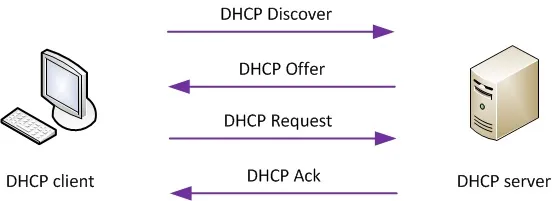

# DHCP Basic Operations: Discover, Offer, Request, ACK

The **Dynamic Host Configuration Protocol (DHCP)** is a network management protocol used to automatically assign IP addresses and other network configuration details to devices on a network.

## Overview of DHCP Process

The DHCP communication between a client and server follows **four main steps**:

1. **DHCP Discover**
2. **DHCP Offer**
3. **DHCP Request**
4. **DHCP Acknowledgment (ACK)**

## 1. DHCP Discover

- **Purpose:** The client broadcasts a message to find available DHCP servers.
- **Details:**
  - Sent to IP address `255.255.255.255` (limited broadcast).
  - Client does **not** yet have an IP address.
  - Contains the client’s MAC address to identify itself.

## 2. DHCP Offer

- **Purpose:** DHCP servers respond with an offer of an available IP address and configuration.
- **Details:**
  - Sent as a **unicast** or broadcast to the client.
  - Includes: offered IP address, subnet mask, lease duration, default gateway, DNS servers, etc.
  - Multiple DHCP servers may respond with offers.

## 3. DHCP Request

- **Purpose:** The client selects an offer and requests the IP address from a specific DHCP server.
- **Details:**
  - Sent as a broadcast to inform all DHCP servers of the chosen offer.
  - Indicates acceptance of the offered IP address.

## 4. DHCP Acknowledgment (ACK)

- **Purpose:** The DHCP server confirms the IP address lease and sends the final configuration.
- **Details:**
  - Sent as a **unicast** to the client.
  - Confirms the client can use the IP address for the lease duration.
  - Client configures its network interface accordingly.

## 📝 Summary Table

| Step         | Sender | Recipient | Type of Message   | Key Purpose                 |
| ------------ | ------ | --------- | ----------------- | --------------------------- |
| **Discover** | Client | Broadcast | Broadcast         | Find available DHCP servers |
| **Offer**    | Server | Client    | Unicast/Broadcast | Offer IP and config         |
| **Request**  | Client | Broadcast | Broadcast         | Request selected IP         |
| **ACK**      | Server | Client    | Unicast           | Confirm IP assignment       |

## Additional Notes

- If the DHCP server denies the request, it sends a **DHCP NAK (Negative Acknowledgment)**.
- Clients renew their IP leases periodically by sending **DHCP Request** messages without repeating the full Discover-Offer cycle.
- The process enables **automatic, centralized IP management**, reducing manual configuration errors.

## Diagram

```plaintext
Client                   DHCP Server
| --- DHCP Discover ---> | (Broadcast)
| <--- DHCP Offer ------- | (Unicast/Broadcast)
| --- DHCP Request ----> | (Broadcast)
| <--- DHCP ACK -------- | (Unicast)
```



## References

- [RFC 2131 - Dynamic Host Configuration Protocol](https://tools.ietf.org/html/rfc2131)
- [How DHCP works - Cisco](https://www.cisco.com/c/en/us/support/docs/ip/dynamic-host-configuration-protocol-dhcp/13788-12.html)
