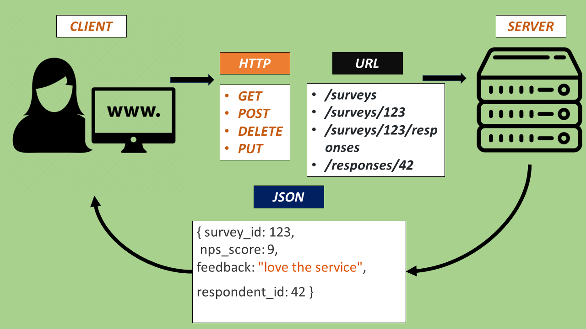

# REST (Representational State Transfer)



## Overview

REST is an architectural style for designing networked applications. It relies on a stateless, client-server communication protocol — typically HTTP — and uses standard HTTP methods. RESTful systems are characterized by their simplicity, scalability, and performance.

---

## Principles of REST

1. **Client-Server Architecture**  
   Separation of concerns improves scalability and portability.

2. **Statelessness**  
   Each request from the client to the server must contain all the information needed to understand and process the request.

3. **Cacheability**  
   Responses must explicitly define themselves as cacheable or not to improve network efficiency.

4. **Uniform Interface**  
   Simplifies and decouples the architecture, enabling independent evolution of the application.

5. **Layered System**  
   A client cannot ordinarily tell whether it is connected directly to the end server or to an intermediary.

6. **Code on Demand (Optional)**  
   Servers can temporarily extend or customize client functionality by transferring executable code.

---

## HTTP Methods in REST

| Method | Description           | Common Usage                          |
| ------ | --------------------- | ------------------------------------- |
| GET    | Retrieve a resource   | Fetching data (e.g., `/users`)        |
| POST   | Create a new resource | Creating a new entry (e.g., `/users`) |
| PUT    | Update a resource     | Updating all data (e.g., `/users/1`)  |
| PATCH  | Partial update        | Updating partial data                 |
| DELETE | Delete a resource     | Removing an entry                     |

---

## RESTful URL Example

```

GET /api/v1/users --> List all users
GET /api/v1/users/1 --> Get user with ID 1
POST /api/v1/users --> Create a new user
PUT /api/v1/users/1 --> Update user with ID 1
DELETE /api/v1/users/1 --> Delete user with ID 1

```

---

## REST vs. SOAP

| Feature     | REST                   | SOAP                    |
| ----------- | ---------------------- | ----------------------- |
| Protocol    | Typically HTTP         | Protocol-independent    |
| Format      | JSON, XML              | Only XML                |
| Simplicity  | Simple and lightweight | Complex and heavyweight |
| Flexibility | High                   | Low                     |

---

## When to Use REST?

- Public APIs
- Mobile and web apps
- When simplicity and scalability are key
- Stateless interactions with standardized HTTP

---

## Resources

- [REST Wikipedia](https://en.wikipedia.org/wiki/Representational_state_transfer)
- [REST API Tutorial](https://restfulapi.net/)
- [Roy Fielding's Dissertation](https://www.ics.uci.edu/~fielding/pubs/dissertation/rest_arch_style.htm)
